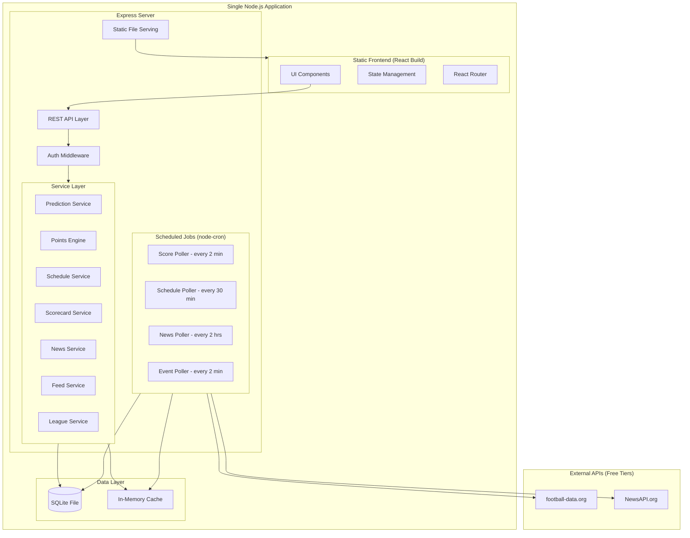
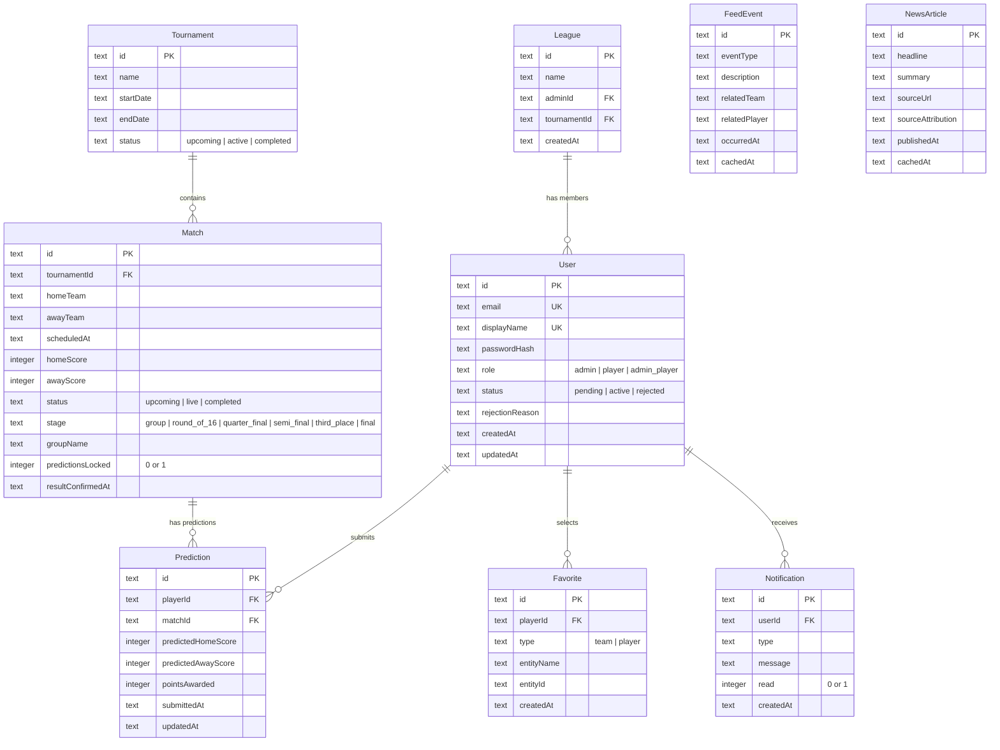

# Design Document: Sports Prediction League

## Overview

The Sports Prediction League is a web application that allows groups of friends to predict match scores for sports tournaments (e.g., FIFA World Cup), earn points based on prediction accuracy, and compete on a shared leaderboard. The platform features dual admin/player roles, personalized dashboards, live scorecards from external APIs, match schedules, sports news, and personalized feeds based on favorite teams and players.

**Key Design Goals:**
- Zero special software required — just Node.js, `npm install`, and `npm start`
- Real-time data freshness for live scores and events
- Fair competition (prediction locking, equal scoring rules)
- Engaging, mobile-first UI for young sports fans
- Resilience to external API failures with graceful degradation

**Technology Stack:**
- **Frontend:** React with TypeScript, Tailwind CSS for styling, React Router for navigation
- **Backend:** Node.js with Express, TypeScript
- **Database:** SQLite via better-sqlite3 (embedded, no separate database server needed)
- **Caching:** In-memory cache with file-based persistence (no Redis required)
- **External APIs:** Football-data.org (free tier) for live scores, schedules, and events; NewsAPI for sports news
- **Authentication:** JWT-based authentication with bcrypt password hashing
- **Deployment:** Single `npm start` command runs both frontend and backend

**What you need to run this:**
- Node.js (v18+) — the only prerequisite
- A free API key from football-data.org (for live scores)
- That's it. No Docker, no PostgreSQL, no Redis, no Nginx.

## Architecture

The system is a single Node.js application serving both the API and the static frontend build. SQLite provides persistent storage without requiring a database server. In-memory caching handles external API response caching.



**Architectural Decisions:**

1. **Single process, no external services:** Everything runs in one Node.js process. SQLite is embedded (no database server). Caching is in-memory with periodic JSON file snapshots for persistence across restarts. This means friends can run it on any laptop or free cloud tier.

2. **Polling over WebSockets for live data:** Background jobs (node-cron) poll external APIs at configured intervals and store results in memory + SQLite. The frontend polls the backend at short intervals. Simple and reliable.

3. **Dedicated Points Engine:** Scoring logic is isolated into a pure function that takes a prediction and a match result, returning points. This enables property-based testing and prevents scoring inconsistencies.

4. **Static frontend served by Express:** The React app is built to static files and served by the same Express server. No separate frontend server needed. In development, Vite's dev server proxies API calls to Express.

5. **SQLite for persistence:** All user data, predictions, and match results persist in a single `.db` file. No schema migrations tool needed — the app creates tables on first run.

6. **In-memory cache with file backup:** External API responses are cached in a simple Map with TTLs. On graceful shutdown, the cache is written to a JSON file and reloaded on startup. This provides resilience without Redis.

## Project Structure

```
sports-prediction-league/
├── package.json
├── .env.example              # API keys template
├── tsconfig.json
├── vite.config.ts            # Frontend build config
├── src/
│   ├── server/               # Backend
│   │   ├── index.ts          # Express app entry point
│   │   ├── db.ts             # SQLite setup & migrations
│   │   ├── cache.ts          # In-memory cache with file persistence
│   │   ├── auth.ts           # JWT middleware
│   │   ├── routes/
│   │   │   ├── auth.routes.ts
│   │   │   ├── admin.routes.ts
│   │   │   ├── predictions.routes.ts
│   │   │   ├── matches.routes.ts
│   │   │   ├── dashboard.routes.ts
│   │   │   ├── news.routes.ts
│   │   │   ├── favorites.routes.ts
│   │   │   └── feed.routes.ts
│   │   ├── services/
│   │   │   ├── points-engine.ts
│   │   │   ├── prediction.service.ts
│   │   │   ├── league.service.ts
│   │   │   ├── schedule.service.ts
│   │   │   ├── scorecard.service.ts
│   │   │   ├── news.service.ts
│   │   │   ├── feed.service.ts
│   │   │   └── favorites.service.ts
│   │   └── jobs/
│   │       ├── score-poller.ts
│   │       ├── schedule-poller.ts
│   │       ├── news-poller.ts
│   │       └── event-poller.ts
│   └── client/               # Frontend
│       ├── main.tsx
│       ├── App.tsx
│       ├── components/
│       │   ├── AuthPages.tsx
│       │   ├── AdminPanel.tsx
│       │   ├── Dashboard.tsx
│       │   ├── PredictionForm.tsx
│       │   ├── Leaderboard.tsx
│       │   ├── Scorecard.tsx
│       │   ├── Schedule.tsx
│       │   ├── NewsFeed.tsx
│       │   ├── PersonalizedFeed.tsx
│       │   ├── FavoritesManager.tsx
│       │   └── ThemeToggle.tsx
│       ├── hooks/
│       ├── context/
│       └── styles/
├── data/                     # SQLite DB file & cache snapshots (gitignored)
└── tests/
    ├── properties/           # Property-based tests
    └── unit/                 # Unit tests
```

## Components and Interfaces

### Frontend Components

| Component | Responsibility |
|-----------|---------------|
| `AuthPages` | Login, registration, join request form |
| `AdminPanel` | Member approval, tournament settings |
| `Dashboard` | Player stats, rank, recent predictions, achievements |
| `PredictionForm` | Score input for upcoming matches |
| `Leaderboard` | Ranked list of all players |
| `Scorecard` | Live and completed match scores |
| `Schedule` | Upcoming matches with filters |
| `NewsFeed` | Tournament news articles |
| `PersonalizedFeed` | Events for favorite teams/players |
| `FavoritesManager` | Select/deselect favorite teams and players |
| `ThemeToggle` | Dark/light mode switch |

### Backend API Endpoints

| Method | Endpoint | Description |
|--------|----------|-------------|
| POST | `/api/auth/join-request` | Submit league join request |
| POST | `/api/auth/login` | Authenticate user |
| GET | `/api/admin/join-requests` | List pending join requests |
| POST | `/api/admin/join-requests/:id/approve` | Approve join request |
| POST | `/api/admin/join-requests/:id/reject` | Reject join request with reason |
| GET | `/api/matches/upcoming` | Get upcoming match schedule |
| GET | `/api/matches/live` | Get live match scores |
| GET | `/api/matches/completed` | Get completed match results |
| POST | `/api/predictions` | Submit/update a prediction |
| GET | `/api/predictions/my` | Get player's predictions |
| GET | `/api/dashboard` | Get player dashboard data |
| GET | `/api/leaderboard` | Get league leaderboard |
| GET | `/api/news` | Get tournament news feed |
| GET | `/api/favorites` | Get player's favorites |
| PUT | `/api/favorites/teams` | Update favorite teams |
| PUT | `/api/favorites/players` | Update favorite players |
| GET | `/api/feed` | Get personalized event feed |
| GET | `/api/tournament/standings` | Get final tournament standings |

### Service Interfaces

```typescript
// Points Engine - Pure function for scoring
interface PointsEngine {
  calculatePoints(prediction: Prediction, matchResult: MatchResult): number;
  determineOutcome(homeScore: number, awayScore: number): MatchOutcome;
}

// Prediction Service
interface PredictionService {
  submitPrediction(playerId: string, matchId: string, homeScore: number, awayScore: number): Promise<Prediction>;
  getPredictions(playerId: string, options?: PaginationOptions): Promise<Prediction[]>;
  lockPredictions(matchId: string): Promise<void>;
  isPredictionWindowOpen(matchId: string): Promise<boolean>;
}

// League Service
interface LeagueService {
  submitJoinRequest(request: JoinRequest): Promise<JoinRequestResult>;
  approveRequest(requestId: string): Promise<void>;
  rejectRequest(requestId: string, reason: string): Promise<void>;
  getLeaderboard(limit?: number): Promise<LeaderboardEntry[]>;
  determineTournamentWinner(): Promise<WinnerResult>;
}

// Schedule Service
interface ScheduleService {
  getUpcomingMatches(filters?: ScheduleFilters): Promise<Match[]>;
  refreshSchedule(): Promise<void>;
}

// Scorecard Service
interface ScorecardService {
  getLiveScores(): Promise<LiveMatch[]>;
  getCompletedMatches(date?: Date): Promise<CompletedMatch[]>;
  confirmMatchResult(matchId: string, result: MatchResult): Promise<void>;
}

// News Service
interface NewsService {
  getArticles(limit?: number): Promise<NewsArticle[]>;
  refreshNews(): Promise<void>;
}

// Feed Service
interface FeedService {
  getPersonalizedFeed(playerId: string): Promise<FeedEvent[]>;
  getGeneralHighlights(): Promise<FeedEvent[]>;
  addEvent(event: TournamentEvent): Promise<void>;
}
```

## Data Models



**Key Data Constraints:**
- One prediction per player per match (unique constraint on `playerId + matchId`)
- Display names unique within a league
- Email addresses unique globally
- Predictions immutable once `predictionsLocked = 1` on the match
- Favorites limited to 5 teams and 10 players per user (enforced at application layer)
- Feed events capped at 100 per player (oldest removed on insert)
- All timestamps stored as ISO 8601 strings (SQLite has no native timestamp type)

## In-Memory Cache Design

```typescript
// Simple TTL-based cache — no Redis needed
interface CacheEntry<T> {
  data: T;
  cachedAt: number;     // Unix timestamp ms
  ttlMs: number;        // Time to live in ms
}

class MemoryCache {
  private store: Map<string, CacheEntry<any>>;
  private persistPath: string;  // data/cache.json

  get<T>(key: string): T | null;          // Returns null if expired
  set<T>(key: string, data: T, ttlMs: number): void;
  persist(): void;                         // Write to JSON on shutdown
  restore(): void;                         // Load from JSON on startup
}

// Cache keys and TTLs
// "live-scores"      → TTL: 2 minutes
// "schedule"         → TTL: 30 minutes
// "news"             → TTL: 2 hours
// "events:{teamId}"  → TTL: 2 minutes
```

## Correctness Properties

*A property is a characteristic or behavior that should hold true across all valid executions of a system—essentially, a formal statement about what the system should do.*

### Property 1: Points calculation correctness

*For any* prediction (predictedHome, predictedAway) and match result (actualHome, actualAway), the Points Engine SHALL award exactly 3 points if predictedHome == actualHome AND predictedAway == actualAway, exactly 1 point if the predicted outcome (home win, away win, or draw) matches the actual outcome but the exact scores differ, and exactly 0 points otherwise.

**Validates: Requirements 4.2, 4.3, 4.4**

### Property 2: Prediction score validation

*For any* score value submitted as a prediction, the system SHALL accept the value if and only if it is a whole number in the range [0, 99]. All values outside this range, non-integer values, or non-numeric values SHALL be rejected.

**Validates: Requirements 3.1, 3.6**

### Property 3: Prediction locking after match start

*For any* match that has started (status = live or completed) and any Player, all prediction submission attempts SHALL be rejected, and the Player's most recently submitted valid prediction (if any) SHALL remain unchanged.

**Validates: Requirements 3.3, 3.5**

### Property 4: One prediction per player per match (replacement semantics)

*For any* sequence of prediction submissions by the same Player for the same match before it starts, there SHALL exist exactly one stored prediction for that (player, match) pair at any point in time, and its values SHALL equal those of the most recent submission.

**Validates: Requirements 3.2, 3.7**

### Property 5: Join request uniqueness enforcement

*For any* league state and join request submission, if the email matches an existing pending request or active Player, or if the display name matches an existing Player's display name in the league, the submission SHALL be rejected. After any sequence of accepted join requests, all active Players SHALL have unique emails and unique display names.

**Validates: Requirements 1.5, 1.6, 1.7**

### Property 6: Join request input validation

*For any* join request where the email does not match a valid email format OR the display name length is less than 3 or greater than 30 characters, the system SHALL reject the submission and indicate which field(s) failed validation.

**Validates: Requirements 1.8**

### Property 7: Tournament ranking with tiebreakers

*For any* set of Players with completed predictions, the final ranking SHALL order Players by (a) total points descending, then (b) number of exact score predictions descending, then (c) number of correct outcome predictions descending, then (d) earliest final prediction submission timestamp ascending. Players tied across all criteria SHALL share the same rank.

**Validates: Requirements 11.1, 11.2, 11.5**

### Property 8: Prediction accuracy calculation

*For any* Player with N total predictions where C of those received at least 1 point (correct outcome), the accuracy percentage SHALL equal (C / N) × 100 rounded to one decimal place. For N = 0, accuracy SHALL be reported as not applicable.

**Validates: Requirements 5.2, 5.7**

### Property 9: Scorecard ordering

*For any* set of matches, the scorecard SHALL display them ordered by status priority (live < upcoming < completed) and within each status group ordered by match time ascending.

**Validates: Requirements 6.7**

### Property 10: Schedule filtering

*For any* set of upcoming matches and any applied filter (stage type or date range), the returned matches SHALL include all and only those matches that satisfy the filter criteria AND have status "upcoming", ordered by scheduled time ascending.

**Validates: Requirements 7.1, 7.5**

### Property 11: Schedule prediction indicator

*For any* Player and set of upcoming matches, the prediction indicator SHALL be present on a match if and only if the Player has a stored prediction for that match.

**Validates: Requirements 7.4**

### Property 12: News feed filtering and ordering

*For any* set of news articles, the news feed SHALL return at most 20 articles, all with publication timestamps within the last 48 hours, ordered by publication date from newest to oldest.

**Validates: Requirements 8.1**

### Property 13: Feed event deduplication

*For any* set of tournament events where an event relates to both a favorited team and a favorited player of the same Player, the unified feed SHALL contain that event exactly once.

**Validates: Requirements 10.4**

### Property 14: Feed bounded buffer

*For any* sequence of events added to a Player's feed, the feed SHALL contain at most 100 events, and those 100 SHALL be the most recent by timestamp. When a new event is added to a full feed, the oldest event is removed.

**Validates: Requirements 10.6**

### Property 15: Feed event ordering

*For any* Player's feed, events SHALL be displayed in reverse chronological order (newest first), and each event SHALL include event type, timestamp, and description.

**Validates: Requirements 10.3**

### Property 16: Favorites count bounds

*For any* Player, the system SHALL maintain between 0 and 5 favorite teams and between 0 and 10 favorite players. Any attempt to add a favorite that would exceed these limits SHALL be rejected with an error indicating the maximum has been reached.

**Validates: Requirements 9.1, 9.2, 9.6**

### Property 17: Favorites deselection

*For any* Player with selected favorites, deselecting any previously selected favorite team or player SHALL succeed and the item SHALL no longer appear in the Player's favorites list.

**Validates: Requirements 9.5**

### Property 18: Leaderboard always includes current player

*For any* leaderboard query by a Player, the result SHALL contain the current Player's entry (rank, points) regardless of whether the Player is in the top 50.

**Validates: Requirements 5.3**

### Property 19: Achievement streak detection

*For any* Player's prediction history, the system SHALL award achievement badges if and only if there exist consecutive sequences of correct predictions (outcome correct) of length ≥ 3, ≥ 5, or ≥ 10 respectively.

**Validates: Requirements 5.6**

### Property 20: Display mode persistence round-trip

*For any* display mode selection (dark or light) by a Player, saving and then loading the preference SHALL return the same mode that was selected.

**Validates: Requirements 12.6**

### Property 21: Admin scoring equality

*For any* prediction and match result, the Points Engine SHALL produce identical point values regardless of whether the predicting user has the Admin role or the Player role.

**Validates: Requirements 2.3**

## Error Handling

### External API Failures

| Scenario | Strategy | User Experience |
|----------|----------|----------------|
| Sports data API unavailable | Serve from in-memory cache + staleness indicator | Last known data shown with "Last updated X minutes ago" badge |
| Score API retry exhaustion (10 attempts) | Mark match as "pending result" in SQLite | "Result pending" status on match, scores/leaderboard unchanged |
| News API unavailable | Serve cached articles from memory | Cached articles with staleness indicator |
| Schedule API unavailable | Serve cached schedule from memory | Cached schedule with staleness indicator |
| Event feed source unavailable | Serve cached events from memory | Cached events with staleness indicator |

### Input Validation Errors

| Scenario | Response |
|----------|----------|
| Invalid email format | 400 with field-specific error: `{ field: "email", message: "Invalid email format" }` |
| Display name out of range | 400 with field-specific error: `{ field: "displayName", message: "Must be 3-30 characters" }` |
| Duplicate email | 409 with message: "Email already in use" |
| Duplicate display name | 409 with message: "Display name unavailable" |
| Invalid prediction score | 400 with message: "Score must be a whole number between 0 and 99" |
| Prediction after lock | 403 with message: "Prediction window closed" |
| Favorites limit exceeded | 400 with message: "Maximum of {limit} favorites reached" |

### System Errors

| Scenario | Strategy |
|----------|----------|
| SQLite file locked | Retry with backoff (WAL mode minimizes this) |
| Authentication token expired | Return 401, client redirects to login |
| Rate limit exceeded on external API | Serve cached data until rate limit resets |

### Error Response Format

```typescript
interface ErrorResponse {
  error: {
    code: string;        // Machine-readable error code (e.g., "PREDICTION_LOCKED")
    message: string;     // Human-readable message
    field?: string;      // Specific field that caused the error (for validation errors)
    details?: Record<string, string>; // Additional context
  };
}
```

## Testing Strategy

### Property-Based Testing

**Library:** fast-check (TypeScript property-based testing library)

**Configuration:** Minimum 100 iterations per property test.

**Tag format:** `Feature: sports-prediction-league, Property {number}: {property_text}`

Property-based tests target the pure business logic:

| Property | Target Component | Key Generators |
|----------|-----------------|----------------|
| 1 (Points calculation) | `PointsEngine.calculatePoints()` | Random scores 0-99 for prediction and result |
| 2 (Score validation) | `PredictionService.validateScore()` | Random integers, floats, negatives, strings |
| 3 (Prediction locking) | `PredictionService.submitPrediction()` | Random matches with started status, random predictions |
| 4 (Replacement semantics) | `PredictionService.submitPrediction()` | Random sequences of predictions for same player/match |
| 5 (Uniqueness enforcement) | `LeagueService.submitJoinRequest()` | Random join request sequences with some duplicates |
| 6 (Input validation) | `LeagueService.validateJoinRequest()` | Random invalid emails, display names of various lengths |
| 7 (Tournament ranking) | `LeagueService.determineTournamentWinner()` | Random player stats with ties at various tiebreaker levels |
| 8 (Accuracy calculation) | `DashboardService.calculateAccuracy()` | Random prediction histories with known outcomes |
| 9 (Scorecard ordering) | `ScorecardService.orderMatches()` | Random match sets with various statuses and times |
| 10 (Schedule filtering) | `ScheduleService.filterMatches()` | Random match sets with various stages and dates, random filters |
| 11 (Prediction indicator) | `ScheduleService.annotateWithPredictions()` | Random matches and prediction sets |
| 12 (News filtering) | `NewsService.filterArticles()` | Random articles with various timestamps |
| 13 (Feed deduplication) | `FeedService.buildFeed()` | Random events overlapping team/player favorites |
| 14 (Bounded buffer) | `FeedService.addEvent()` | Random event sequences exceeding 100 |
| 15 (Feed ordering) | `FeedService.getPersonalizedFeed()` | Random event sets with various timestamps |
| 16 (Favorites bounds) | `FavoritesService.addFavorite()` | Random add/remove sequences testing boundaries |
| 17 (Favorites deselection) | `FavoritesService.removeFavorite()` | Random favorites lists with random removals |
| 18 (Leaderboard inclusion) | `LeaderboardService.getLeaderboard()` | Random player counts with current player at various ranks |
| 19 (Streak detection) | `DashboardService.detectStreaks()` | Random prediction histories with various streak patterns |
| 20 (Display mode persistence) | `PreferenceService.saveAndLoad()` | Random mode selections |
| 21 (Admin scoring equality) | `PointsEngine.calculatePoints()` | Random predictions with admin vs player role |

### Unit Tests (Example-Based)

Focus areas for unit tests:
- Admin role assignment on league creation (2.1)
- Dashboard empty state (5.7)
- Final score display for completed matches (6.3)
- Winner announcement visibility (11.3)
- Join request notification creation (1.2)
- Timezone conversion edge cases (7.2)
- News article link behavior (8.4)

### Integration Tests

Focus areas for integration tests:
- External API polling and retry logic (4.6, 4.7)
- Leaderboard update timing after result confirmation (4.5)
- Schedule refresh from external source (7.3)
- News feed refresh interval (8.2)
- Feed event delivery timing (10.1, 10.2)
- Cache fallback behavior for all external data sources (6.5, 7.6, 8.5, 10.7)
- SQLite constraint enforcement (unique email, unique display name)

### End-to-End Tests

- Complete prediction flow: register → join → predict → match completes → points awarded → leaderboard updates
- Admin flow: create league → approve members → participate as player
- Tournament completion: all matches scored → winner determined → announcement displayed

## How to Run

```bash
# 1. Clone and install
git clone <repo-url>
cd sports-prediction-league
npm install

# 2. Set up API keys (copy template and add your free keys)
cp .env.example .env
# Edit .env with your football-data.org API key

# 3. Run in development
npm run dev

# 4. Build and run for production
npm run build
npm start
```

No Docker. No database server. No Redis. Just Node.js.
